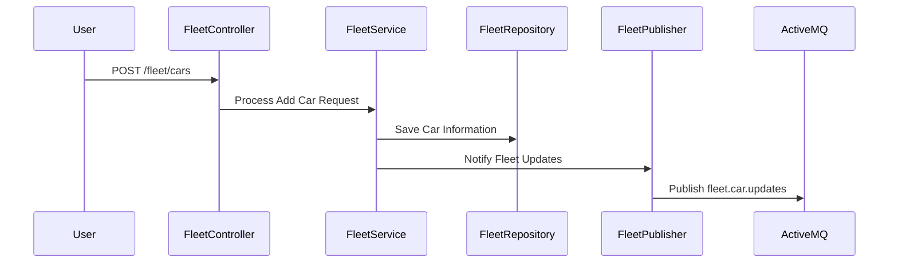
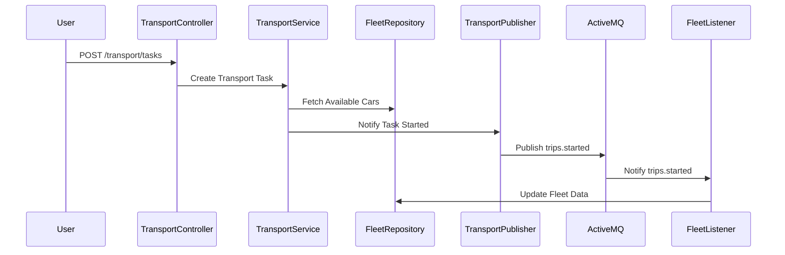

# Final project

# Basic Info
Electric-car-transport-system:
submodules:
fleet: contains the cars and notifies transport of fleet changes. Updates car batteries after charging. Also gets notified when trips are started or completed.
transport: gets updates about the available cars to use for transports, also gets notified when cars are added or deleted. Handles trip simulations and notifies fleet about start or completion.
charging: Handles charging the vehicles, fetches the cheapest hour to start charging, simulates the charge process and notifies fleet about car battery updates.

# Instructions
This works with a local ActiveMQ server running at localhost:8161
navigate to the server-directory
"cd apache-activemq-6.X.X"
"./bin/activemq start"

Check server is up and running by navigating to: http://localhost:8161
user: admin
psswrd: admin

You can then navigate to http://localhost:8161/admin -> Queues to see if the messages sent in the next steps come through.

Start up the transport, fleet and charging repositories by navigating to them and running:
"mvn spring-boot:run"

Now that everything is up and running, let's test the entire application by interacting with all the available endpoints across the fleet, transport and charging services.

1. Fleet Service
Base URL:
http://localhost:8080/fleet

# 1.1 Add a Car (POST)
curl -X POST -H "Content-Type: application/json" -d '{"id": "car-2", "model": "Tesla Model Y", "batteryCapacity": 100, "currentBatteryLevel": 80, "charging": false}' http://localhost:8080/fleet/cars

# Expected Result:
Car added successfully.
# Fleet logs
Added a car to the fleet: [Car{id='car-2', model='Tesla Model Y', batteryCapacity=100, currentBatteryLevel=80, charging=false}]
Fleet now contains: 1 cars.


# 1.2 Get All Cars (GET)
curl http://localhost:8080/fleet/cars
# Expected Result:
[{"id":"car-2","model":"Tesla Model Y","batteryCapacity":100,"currentBatteryLevel":80,"charging":false},
{"id":"car-1","model":"Tesla Model S","batteryCapacity":100,"currentBatteryLevel":100,"charging":false}]

# 1.3 Get a Specific Car by ID (GET)
curl http://localhost:8080/fleet/cars/car-2
# Expected Result:
{"id":"car-2","model":"Tesla Model Y","batteryCapacity":100,"currentBatteryLevel":80,"charging":false}

# 1.4 Update a Car (PUT)
curl -X PUT \
     -H "Content-Type: application/json" \
     -d '{
           "id": "car-2","model": "Tesla Model Y","batteryCapacity": 100,"currentBatteryLevel": 70,"charging": false
         }' \
     http://localhost:8080/fleet/cars/car-2
# Expected Result:
Car updated successfully.

# 1.5 Delete a Car (DELETE)
curl -X DELETE http://localhost:8080/fleet/cars/car-2
# Expected Result:
Car deleted succesfully.

2. Transport service
Base URL:
http://localhost:8082/device

# 2.1 Start a trip (POST)
curl -X POST -H "Content-Type: application/json" -d '{"id": "task-1", "destination": "Downtown", "requiredBatteryLevel": 50, "tripDuration": 10, "batteryDrain": 5, "isCompleted": false}' http://localhost:8082/transport/tasks

 # Expected Result when a car is available:
Task created successfully.

# Transport logs:
Task created and assigned to car: car-1
Starting trip for car car-1 to Downtown
Published trip started: {"status":"STARTED","carId":"car-1"}
Car car-1 battery level: 75%
Car car-1 battery level: 70%
Car car-1 battery level: 65%
Car car-1 battery level: 60%
Car car-1 battery level: 55%
Car car-1 battery level: 50%
Car car-1 battery level: 45%
Car car-1 battery level: 40%
Car car-1 battery level: 35%
Car car-1 battery level: 30%
Trip for car car-1 to Downtown completed.
Published trip completed: {"status":"COMPLETED","carId":"car-1"}
Published car update: {"carId":"car-1","batteryLevel":30}

# Fleet logs:
Received trip started event: TripEvent{status='STARTED', carId='car-1'}
Received trip completed event: TripEvent{status='COMPLETED', carId='car-1'}
Received car update with ID: {"carId":"car-1","batteryLevel":30}

# If there is not a car available or battery is too low:
Failed to create task. No suitable car available.

3. Charging Service
Base URL:
http://localhost:8081/charging

# 3.1 Request a Charge (POST)
curl -X POST "http://localhost:8081/charging/start/car-1?currentBatteryLevel=30&batteryCapacity=100"
# Expected Result:
Charging process completed for car: car-1%

# Charging Logs:
Cheapest charging hour for car car-1: Hour 4 with price: 0.617 cents/kWh.
Car car-1 charging: 40%
Car car-1 charging: 50%
Car car-1 charging: 60%
Car car-1 charging: 70%
Car car-1 charging: 80%
Car car-1 charging: 90%
Car car-1 charging: 100%
Car car-1 is fully charged!

# Fleet logs:
Updated car car-1 battery level to 100%.
Updated battery level for car: car-1


# Sequence Diagrams:

### Fleet Module Interaction (Add a Car)


### Transport Module Interaction (Start a Transport Task)

### Charging Module Interaction (Start Charging)
```mermaid

sequenceDiagram
    participant User
    participant ChargingController
    participant ChargingService
    participant ElectricityPriceService
    participant PörssisähköAPI
    participant PricingService
    participant BatteryUpdate
    participant ChargingPublisher
    participant ActiveMQ
    participant FleetListener
    participant FleetRepository

    User ->> ChargingController: POST /charging/start/car-1
    ChargingController ->> ChargingService: Initiate Charging
    ChargingService ->> ElectricityPriceService: Fetch Electricity Prices
    ElectricityPriceService ->> PörssisähköAPI: GET /price.json
    PörssisähköAPI -->> ElectricityPriceService: Return Prices
    ElectricityPriceService -->> ChargingService: Send Prices
    ChargingService ->> PricingService: Determine Cheapest Hour
    PricingService -->> ChargingService: Return Cheapest Hour
    ChargingService ->> BatteryUpdate: Simulate Charging Process
    ChargingService ->> ChargingPublisher: Notify Battery Updates
    ChargingPublisher ->> ActiveMQ: Publish fleet.car.updates
    ActiveMQ ->> FleetListener: Notify fleet.car.updates

